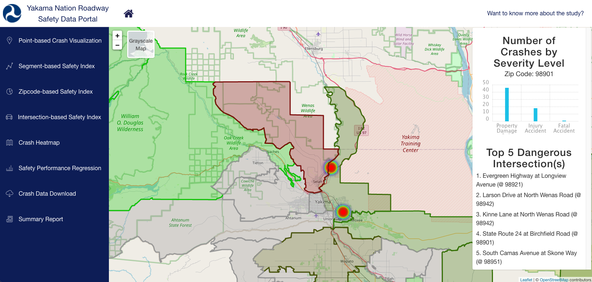

# Yakama Nation Roadway Safety Data Portal



<h2 align="center"><a  href="http://128.95.29.72:3001/">Live Demo</a></h2>

## Introduction

Funded by U.S. Department of Transportation “State and Local Government Data Analysis Tools for Roadway Safety” grant, the Yakama Nation Roadway Safety Data Portal is an online comprehensive roadway safety data visualization and evaluation platform. The system is based on a transportation multi-source data management, fusion, analysis, and visualization platform that the University of Washington STAR Lab team has developed, called the Digital Roadway Interactive Visualization and Evaluation Network (DRIVE Net) (Xiao et al., 2015; Wang et al., 2016). The system provides users with the capability to store and manage the safety data efficiently. Besides data management, the system also supports various analytical and visualization functions, such as crash data visualization, crash modeling analysis, roadway safety performance index estimation, network screening and hotspot identification, etc.

## Features

1. [Point-based Crash Visualization](http://128.95.29.72:3001/applications/point-safety-index/)
2. [Segment-based Safety Index Visualization](http://128.95.29.72:3001/applications/segment-safety-index/)
3. [Zipcode-based Safety Index Visualization](http://128.95.29.72:3001/applications/zipcode-safety-index/)
4. [Intersection-based Safety Index Visualization](http://128.95.29.72:3001/applications/intersection-safety-index/)
5. [Crash Heatmap](http://128.95.29.72:3001/applications/accident-heatmap/)
6. [Safety Performance Regression/Visualization](http://128.95.29.72:3001/applications/incident-frequency/)
7. [Crash Data Download](http://128.95.29.72:3001/applications/crash-data-download/)
8. [Summary Report](http://128.95.29.72:3001/applications/summary-report/)

## Data Collection

The STAR Lab team had worked with Yakama Nation DNR Engineering team to check the available safety related data sources, collect, store and manage the collected data into the developed database management system. Specifically, the data preparation included the following steps.  

### Data collection
The UW research team had worked with the Yakama Nation DNR Engineering team for safety-related datasets including the [Highway Safety Information System (HSIS) dataset](https://www.hsisinfo.org/data.cfm), [statewide weather station data by Washington State Department of Transportation (WSDOT)](https://wsdot.com/travel/real-time/weather), [WSDOT crash data portal](https://remoteapps.wsdot.wa.gov/highwaysafety/collision/data/portal/public/), and [Washington state GIS roadway network data](https://www.wsdot.wa.gov/mapsdata/geodatacatalog/). These datasets were then cleaned and stored to the database

### Data integration
Multi-source datasets were integrated into the database system, for redundant data across data sources, if all attribute values are duplicated, then the entire data was deleted. For some cases where redundant attributes were used, correlation analysis and monitoring was performed to determine whether the original data can be restored.

### Data management
The datasets used in this research were managed in the database system in MS SQL server and PostgreSQL databases.

## How to Setup API Server

This section provides guidance for setting up Express-based client development and deployment environments for Yakama Nation Roadway Safety Data Portal API Server.

### Prerequisite
The API server, which is developed by `Express.js`. Therefore, [Node.js](https://nodejs.org/en/) needs to be installed to use `npm` and `webpack` for client code development and deployment.

### Steps to set up and run the server
- Git clone source code from this repository and install all dependencies.

```
 git clone https://github.com/AI-Group-STAR-Lab-UW/yakama-nation-roadway-safety-data-portal.git
 cd yakama-nation-roadway-safety-data-portal/yakama-nation-roadway-safety-data-portal-server/
 npm install
```

- Host the API Server in your local site.

```
nodemon app.js
```
If nodemon is not recognized as internal or external command, add the `npm prefix path` to the `environment variables`. Please visit here for the more detailed solution: [Link](https://stackoverflow.com/questions/51278650/nodemon-is-not-recognized-as-an-internal-or-external-command-while-running-us).

Or you can either run the following command to host the server.
```
node app.js
```

- Check if the API server run successfully. Go to [http://localhost:3010](http://localhost:3010) see if the website shows `Yakama Nation Roadway Safety Data Portal API Server Running!`.

- Customize server port. The port number can be set in `app.js`. The current port is set as `3010`.

### Live Demo API Server

The official-hosted API server can be accessed through [http://128.95.29.72:3010](http://128.95.29.72:3010).

## How to Setup Yakama Nation Roadway Safety Data Portal

This section provides guidance for setting up React-based client development and deployment environments for Yakama Nation Roadway Safety Data Portal.

### Prerequisite
[Node.js](https://nodejs.org/en/) needs to be installed to use `npm` and `webpack` for client code development and deployment.

### Steps to set up and run the tool
- Check if the API server run successfully. Go to [http://128.95.29.72:3010](http://128.95.29.72:3010) and see if the website shows `Yakama Nation Roadway Safety Data Portal API Server Running!`. You can also customize your own API Server based on the given datasets. The path is set in `./yakama-nation-roadway-safety-data-portal/yakama-nation-roadway-safety-data-portal/src/constants/domain.js`, which can be replaced by customized API server urls.


- Git clone source code from this repository and install all dependencies.

```
 git clone https://github.com/AI-Group-STAR-Lab-UW/yakama-nation-roadway-safety-data-portal.git
 cd yakama-nation-roadway-safety-data-portal/yakama-nation-roadway-safety-data-portal/
 npm install
```

- For local development, run `npm start` then the website can be hosted locally; for production deployment, run `npm run build`.

## Contacts
### Yakama Nation DNR Engineering
Al Pinkham, Engineering Planner II, al_pinkham@yakama.com <br />
HollyAnna Littlebull, Traffic Safety Coordinator, hollyanna_littlebull@yakama.com <br />
Portia Shields, Data Manager, portia_shields@yakama.com <br />

### U.S. Department of Transportation
Paul Teicher, Senior Policy Analyst, paul.teicher@dot.gov <br />
Tom Bragan, Traffic Records Division, NHTSA, tom.bragan@dot.gov <br />

### UW STAR Lab
Yinhai Wang, Professor and Director of PacTrans, yinhai@uw.edu <br />
Wei Sun, Postdoc Research Associate, wsun91@uw.edu <br />
Meng-Ju (Dennis) Tsai, Research Assistant, mjtsai@uw.edu <br />
Sam Ricord, Research Assistant, samuelsr@uw.edu <br />
Meixin Zhu, Research Assistant, meixin92@uw.edu <br />

## Credits
This project exists thanks to all the people who contribute from Yakama Nation DNR Engineering, USDOT, and UW STAR Lab.

## License
Yakama Nation Roadway Safety Data Portal is [MIT licensed](./LICENSE).
